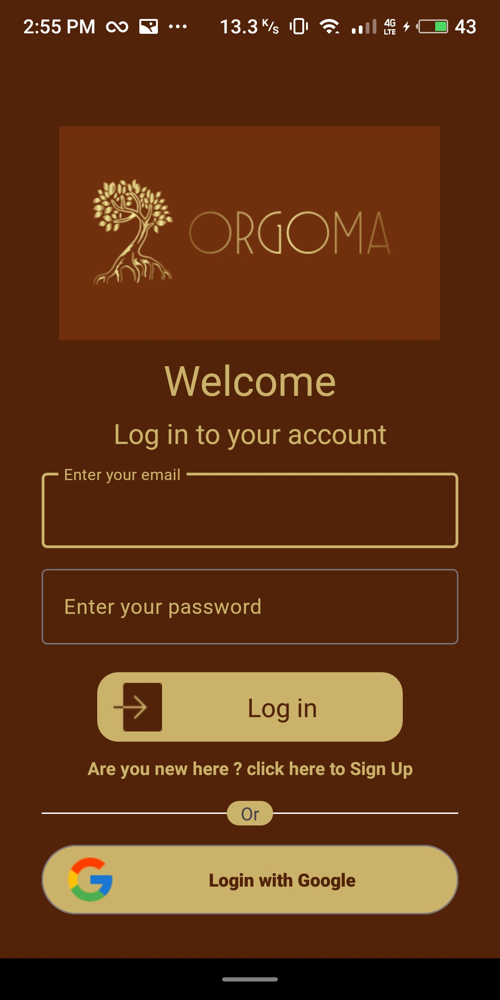

    

<h2 style="text-align: center; font-size: 35px">💖Information about the app😀</h2>

    This application aims to be a complete assistant for people engaged in agricultural work, 
    specifically with field spraying. The application enables users to enter their fields along 
    with some important information about them on the map. It also enables users to know which fields 
    are organically farmed and which are not. That is, which fields can be sprayed and which can not. 
    There are two main roles in the application, the first is the Owner who will enter his fields on the map. 
    The application also distinguishes the role of the Spray worker, who will spray the fields to combat pests.

<h2 style="text-align: center; font-size: 35px">😎Technologies used🌎</h2>

    The app is only available at the moment for android devices, so for the development of the app
    I have used Java alongside with his IDE that is called Android Studio.
    I have used Firestore for storing the date of the app. Firestore is a no-SQL database developed 
    by Google. Also, I use the Authentication module that Google provide to authenticate the users 
    with their Google account but also with accounts from another provider, if they have.

<h2 style="text-align: center; font-size: 35px">👥Users and functions👽</h2>

    

        The users are of two types. The first is the Owner and the second is the Spray worker.
        In the following table, you can see the functions each type of user has.
    

    

        

            <table>
                <tr>
                    <th>///////</th>
                    <th>Mark field</th>
                    <th>Start recording</th>
                    <th>Delete field</th>
                    <th>Display info of a field</th>
                    <th>View public Map</th>
                </tr>
                <tr>
                    <td>Owner</td>
                    <td>+</td>
                    <td>+</td>
                    <td>+</td>
                    <td>+</td>
                    <td>+</td>
                </tr>
                <tr>
                    <td>Spray worker</td>
                    <td></td>
                    <td>+</td>
                    <td></td>
                    <td>+</td>
                    <td>+</td>
                </tr>
            </table>
        

    

    

        For better understanding of the functions available in the app,
        you can also see the following use case diagram. 
    

    

        
    

<h2 style="text-align: center; font-size: 35px">🙄Log in & Sign up🏃‍♂️</h2>

    

        In the app the user can log in and sign up using &#x1F4A1 Google but also their 
        personal account 🙌.
         
        You can see in the following screens the log in and Sign up views.
    

    
    

<h2 style="text-align: center; font-size: 35px">👨‍💻How to run the app🎮</h2>

    In the folder ./App you can find the apk file of the app. You can test and use the app
    with two ways. The first way is by downloading an android emulator (ex. Bluestacks) 
    in your pc and then just simply run the apk file using that emulator. The other way is by 
    downloading Android Studio and the code of the app from the repo, then just connect your 
    phone in the pc, with enabled the Developer options on it, build and run the app in Android 
    Studio and then the app will be installed on your phone. You can also use the emulator of Android
    Studio (need a lot of resources)

<h2 style="text-align: center; font-size: 35px">🏁Screenshots of the app🌠</h2>

            For more info about the app see the videos available in the folder /videos 🎬

    
    
    
    
    
    
    
    

